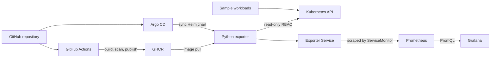

<!-- Updated 2026-10-09: refreshed paths, architecture, metrics, and CI behavior for the current lab. -->
# Kubernetes Resource Monitoring

A personal DevOps lab that monitors Kubernetes workloads with a small Python exporter, Prometheus, and Grafana. It runs on Docker Desktop Kubernetes and uses Helm and Argo CD for deployment.

## Architecture



The exporter reads live Kubernetes API state. The sample manifest at `kubernetes/helm-monitor/temp_app.yaml` creates example resources; the exporter does not parse that file. Two exporter replicas provide process redundancy, while each replica reports the same cluster-wide totals. Queries for these metrics should use `max` aggregation to avoid counting both replicas twice.

## Metrics

- `k8s_pods{namespace,phase}`: pod counts by namespace and phase
- `k8s_nodes_total` and `k8s_nodes_ready`: total and Ready nodes
- `k8s_namespaces_total`: namespace count
- `k8s_namespace_resources{namespace,resource}`: Deployment, Service, and ConfigMap counts
- `k8s_deployment_replicas{namespace,deployment,state}`: desired, ready, and available replicas

Example PromQL that avoids duplicate exporter samples:

```promql
max by (namespace, phase) (k8s_pods)
```

## Repository map

```text
src/                         Python exporter and aggregation helper
tests/                       pytest unit tests for aggregation
kubernetes/helm-monitor/     Helm chart and sample workload manifest
kubernetes/prometheus/       kube-prometheus-stack values
kubernetes/grafana/          Grafana values
kubernetes/argocd/           Argo CD configuration
.github/workflows/CI.yaml    tests, image build, Trivy scan, and publish
```

## Local build and install

Requires Docker Desktop Kubernetes, kubectl, Helm, and a Prometheus Operator installation that discovers the chart's ServiceMonitor.

```powershell
docker build -t helm-monitor:dev .
helm upgrade --install helm-monitor ./kubernetes/helm-monitor --namespace minilab --create-namespace `
  --set image.repository=helm-monitor --set image.tag=dev
```

The local cluster must be able to access the image built above. For GitOps deployment, Argo CD tracks `kubernetes/argocd/helm-monitor.yaml`; GitHub Actions builds and scans the image, publishes it on `main`, and updates the chart image tag.

## CI checks

GitHub Actions runs YAML and Helm checks for the configured repository changes. Python changes run pytest. Docker image build, Trivy report, and publishing run only when `src/**`, `Dockerfile`, or `requirements.txt` changes (or when manually requested with `build_image`). Trivy currently reports HIGH and CRITICAL vulnerabilities without blocking publication so compatibility-related findings can be reviewed first.
