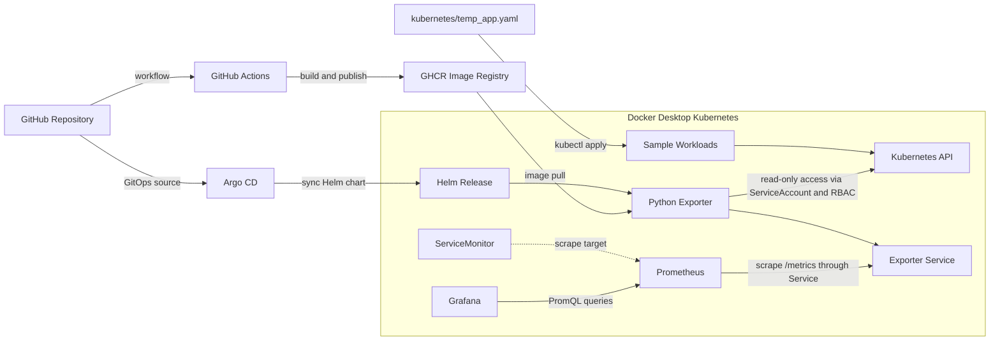

# Kubernetes Resource Monitoring

A personal DevOps project that monitors Kubernetes resources with a small Python exporter, Prometheus, and Grafana. The lab runs on Docker Desktop Kubernetes.

## Architecture

The exporter reads live cluster state through the Kubernetes API. Prometheus discovers and scrapes it through a ServiceMonitor, and Grafana queries Prometheus to display the metrics. GitHub Actions builds and publishes the image; Argo CD syncs the Helm chart from the repository.



The Helm chart deploys the exporter with a dedicated ServiceAccount and read-only RBAC. The container runs as a non-root user with health probes and resource limits. Argo CD tracks the chart in this repository for GitOps deployment.

## Exported metrics

- Pod counts by namespace and phase
- Node and namespace totals, including Ready nodes
- Deployment desired, ready, and available replicas
- Service and ConfigMap counts by namespace

The exporter reports resources applied to the cluster; it does not parse the example manifests as live state.

## Repository layout

```text
src/                 Python exporter
kubernetes/          Helm chart and sample workloads
prometheus/          kube-prometheus-stack values
grafana/             Grafana persistence values
argocd/              Argo CD Application manifest
.github/workflows/   Manual test, image build, scan, and publish workflow
```

## Local workflow

Requires Docker Desktop Kubernetes, kubectl, Helm, and an installed kube-prometheus-stack. Build and make the image available to the local cluster, then install the chart:

```powershell
docker build -t helm-monitor:dev .
helm upgrade --install helm-monitor ./kubernetes --namespace minilab --create-namespace `
  --set image.repository=helm-monitor --set image.tag=dev
```

The Helm command overrides the chart's default GHCR image with the local image built above. Make sure Docker Desktop Kubernetes can access that image.

The GitHub Actions workflow is started manually from the Actions tab. It runs the repository tests, builds and scans the image, and publishes it to GHCR when run from `main`.
